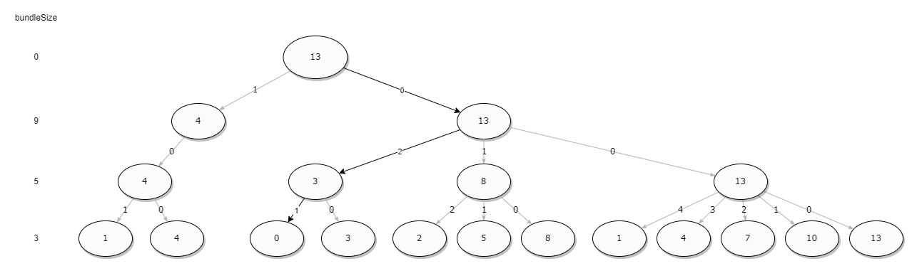

## Flower shop

Solution of iCare coding test

## Approach

The solutions can be structured as a tree, where each node is the number of remaining items to cover, the depth
correspond to the current bundle size, each edge is the number of the current bundle to use, and the leaf is the final
remaining items to cover. The tree can be constructed by a recursive function, which try to find the best solution to
cover the number of remaining items using fewer bundles as possible. The best solution is the path from the root to the
leaf with the minimum number of bundles and the number of remaining items equal to 0.
The order of the bundles is important, because the algorithm will try to use the biggest bundle first, and then the
second biggest, and so on.
In this way the first solution found, if it's present, will be the best one.

